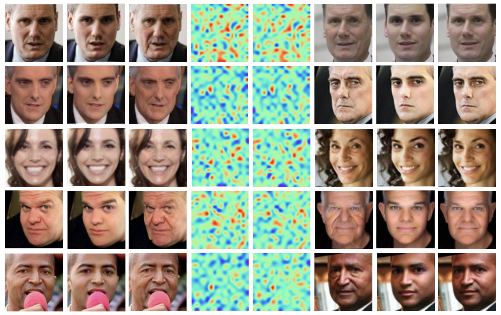
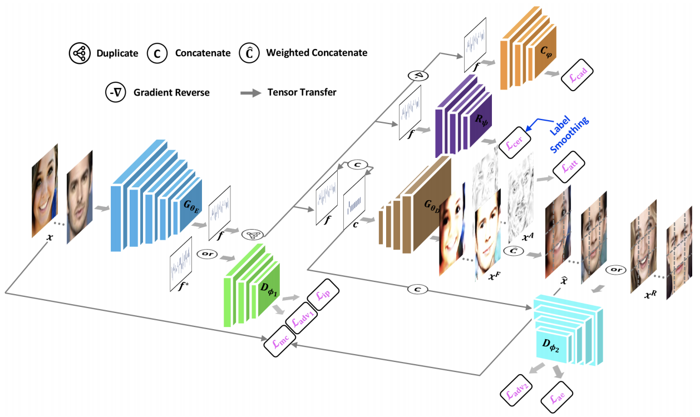

### Look Across Elapse: Disentangled Representation Learning and Photorealistic Cross-Age Face Synthesis for Age-Invariant Face Recognition


- TensorFlow implementation of the algorithm in our AAAI 2019 [Paper](https://arxiv.org/pdf/1809.00338.pdf) (oral).

<p align="center">
  
</p>

<p align="center">
  
</p>


## Getting Started
Clone the repo:

```
git clone https://github.com/ZhaoJ9014/High_Performance_Face_Recognition/edit/master/src/Look%20Across%20Elapse-%20Disentangled%20Representation%20Learning%20and%20Photorealistic%20Cross-Age%20Face%20Synthesis%20for%20Age-Invariant%20Face%20Recognition.TensorFlow.git
```

Download the UTKFace data ([Google Drive](https://drive.google.com/file/d/1T5KH-DWXu048im0xBuRK0WEi820T28B-/view?usp=sharing), [Baidu Drive](https://pan.baidu.com/s/12Qp5pdZvitqBYSJHm4ouOw)), put into the "data" folder, and run ```python train_main.py```.


## Citation
- Please consult and consider citing the following paper:

      @article{zhao2018look,
      title={Look Across Elapse: Disentangled Representation Learning and Photorealistic Cross-Age Face Synthesis for Age-Invariant Face Recognition},
      author={Zhao, Jian and Cheng, Yu and Cheng, Yi and Yang, Yang and Lan, Haochong and Zhao, Fang and Xiong, Lin and Xu, Yan and Li, Jianshu and Pranata, Sugiri and others},
      journal={AAAI},
      year={2019}
      }
