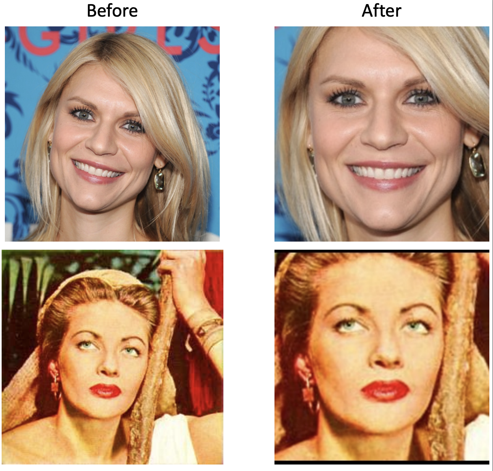

# Face Alignment and Resize with Padding with PyTorch

This repo provides a easy-to-use helper function for accurate face alignment & resize with padding using PyTorch.

### Pre-requisites

* Python 3.5+ or Python 2.7 (it may work with other versions too)
* Linux, Windows or macOS
* PyTorch (>=0.4)
* [Facial Landmark Localization Tool](https://arxiv.org/pdf/1703.07332.pdf) (Install: `pip install face-alignment` or `conda install -c 1adrianb face_alignment`; Refer to this [repo](https://github.com/1adrianb/face-alignment) for more details.)

While not required, for optimal performance(especially for the detector) it is **highly** recommended to run the code using a CUDA enabled GPU.

### Usage

* Organize the face images of different identities for processing under the folder 'test'. Modify the paths if needed.
* Run 'face_norm.py' as an example to investigate how to call 'face_alignment' for predicting 68 faical key points, 'FaceAligner' for aligning face images, and 'FaceResizer' for resizing face images with padding.
* For usage with GPUs, replace 'predictor = face_alignment.FaceAlignment(face_alignment.LandmarksType._2D, flip_input=False, device='cpu').get_landmarks' with 'predictor = face_alignment.FaceAlignment(face_alignment.LandmarksType._2D, flip_input=False).get_landmarks' in 'face_norm.py'.
* The aligned and resized face images will be automatically stored to the folder 'test_aligned', the subfolder names and image names remain unchanged. Modify the paths if needed.

</img>

